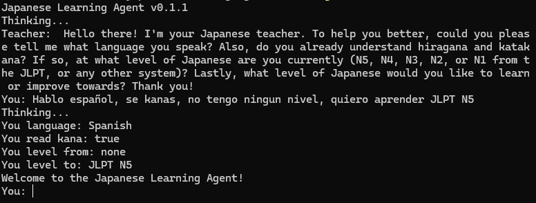

# 🏯 Japanese Learning Agent with Ollama
 
 Tiny CLI to learn Japanese using a local Ollama model (Mistral).

 
 
 ## Requirements
 
 - Ollama installed and running: https://ollama.com/
 - Mistral model available in Ollama.
 - Windows, Linux, or macOS.
 
 ## Quick start
 
 ```sh
 # Ensure the model is available
 ollama pull mistral
 
 # Run the app
 japanese-learning-agent-ollama
 ```
 
 ## Download
 
 Grab the latest binaries from [Releases](https://github.com/jonathanhecl/japanese-learning-agent-ollama/releases).
  
  ## 📝 License
  
  Apache License
